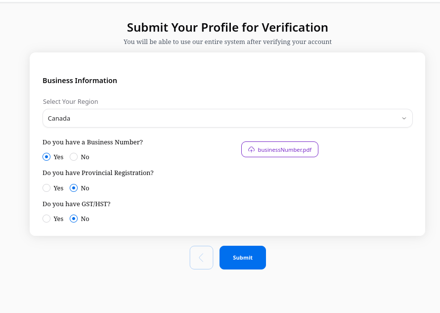
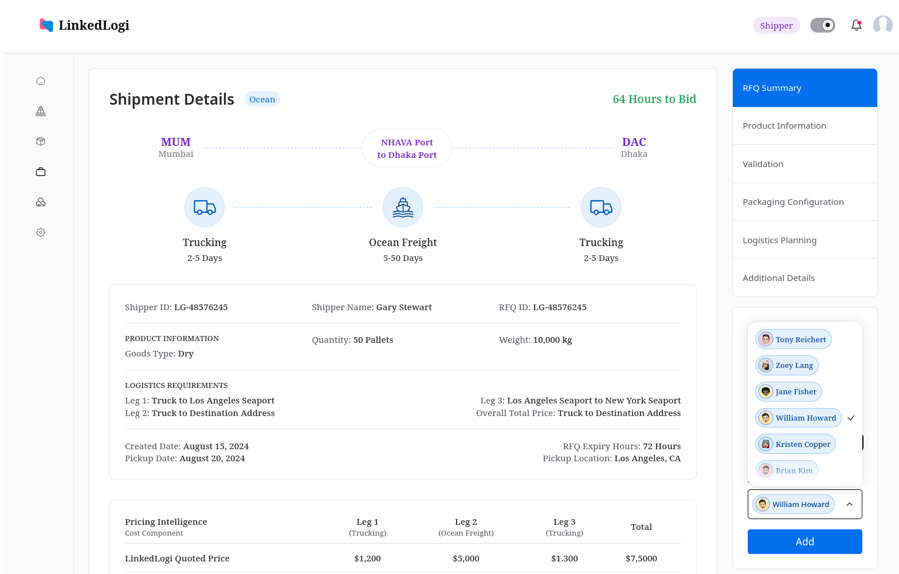

<!-- PROJECT LOGO -->
 

  

<h3 align="center">LinkedLogi</h3>

  

    Ship From One Pallet To A Full Container With Ease
     
    <a href="https://linkedlogi.com">View Demo</a>
  

<!-- TABLE OF CONTENTS -->

  
Table of Contents

  <ol>
    <li>
      <a href="#about-the-project">About The Project</a>
      <ul>
        <li><a href="#built-with">Built With</a></li>
      </ul>
    </li>
    <li>
      <a href="#getting-started">Getting Started</a>
      <ul>
        <li><a href="#prerequisites">Prerequisites</a></li>
        <li><a href="#installation">Installation</a></li>
      </ul>
    </li>
    <li><a href="#usage">Usage</a></li>
    <li><a href="#roadmap">Roadmap</a></li>
    <li><a href="#contributing">Contributing</a></li>
    <li><a href="#license">License</a></li>
    <li><a href="#contact">Contact</a></li>
    <li><a href="#acknowledgments">Acknowledgments</a></li>
  </ol>

<!-- ABOUT THE PROJECT -->

## About The Project

LinkedLogi is a comprehensive logistics platform that streamlines the shipping process, enabling users to efficiently manage shipments ranging from single pallets to full containers. The platform bridges the gap between shippers and logistics providers through an intuitive digital interface.

(<a href="#readme-top">back to top</a>)

### Built With

- [![Next][Next.js]][Next-url]
- [![Node.js][Node.js]][Node-url]
- [![Express.js][Express.js]][Express-url]
- [![MongoDB][MongoDB]][MongoDB-url]
- [![AWS][AWS]][AWS-url]

(<a href="#readme-top">back to top</a>)

## Usage

Here's how you can utilize LinkedLogi's key features to streamline your shipping operations:

### General Properties:

- Used Next.js and NextUI to build the frontend.
- Optimized the website for mobile and desktop.
- Images are optimized using Next Image Optimization.
- Built the website SEO friendly.
- Efficient use of NextJS Server Actions to fetch and send data to the database.
- Used custom hooks to handle all the states and make it reusable.

### 1. Shipper Verification:

**Properties:**

- Multi page form to collect all the necessary information.
- Region based Document Uploads.
- Storing Documents in AWS S3.

### 2. Request a Quote:

Create and submit a detailed RFQ.

**Properties:**

- Multi page form to collect all the necessary information.
- Automatically calculate the freight cost based on the origin, destination, and commodity.
- Submit Quotes via mobile verification.

### 3. Admin Dashboard:

**Properties:**

- View all the RFQs and Add providers to the RFQs.
- View all shipper verification submissions and verify them.
- View all the providers and add them to the platform.
- Calendly Integration to schedule meetings with providers.

### 4. Logistic Provider Verification:

**Properties:**

- Multi page form to collect all the necessary information.
- Region based Document Uploads.
- Storing Documents in AWS S3.
- Capabilities form submission

(<a href="#readme-top">back to top</a>)

## Backend Properties:

- Used Node.js and Express.js to build the Rest API.
- Used MongoDB to store the data.
- Used AWS S3 to store the documents.
- Made the api endpoints secure using JWT tokens.
- Refresh token is used to keep the user logged in.
- Used cron jobs to send RFQs to the providers.

## Contributions:

I was the top contributor to this project. Handling both frontend and backend. The project is still under development.

- Commits: 100+
- Lines of Code: 10000+

[contributors-shield]: https://img.shields.io/github/contributors/github_username/repo_name.svg?style=for-the-badge
[contributors-url]: https://github.com/github_username/repo_name/graphs/contributors
[forks-shield]: https://img.shields.io/github/forks/github_username/repo_name.svg?style=for-the-badge
[forks-url]: https://github.com/github_username/repo_name/network/members
[stars-shield]: https://img.shields.io/github/stars/github_username/repo_name.svg?style=for-the-badge
[stars-url]: https://github.com/github_username/repo_name/stargazers
[issues-shield]: https://img.shields.io/github/issues/github_username/repo_name.svg?style=for-the-badge
[issues-url]: https://github.com/github_username/repo_name/issues
[license-shield]: https://img.shields.io/github/license/github_username/repo_name.svg?style=for-the-badge
[license-url]: https://github.com/github_username/repo_name/blob/master/LICENSE.txt
[linkedin-shield]: https://img.shields.io/badge/-LinkedIn-black.svg?style=for-the-badge&logo=linkedin&colorB=555
[linkedin-url]: https://linkedin.com/in/linkedin_username
[product-screenshot]: images/screenshot.png
[Next.js]: https://img.shields.io/badge/next.js-000000?style=for-the-badge&logo=nextdotjs&logoColor=white
[Next-url]: https://nextjs.org/
[React.js]: https://img.shields.io/badge/React-20232A?style=for-the-badge&logo=react&logoColor=61DAFB
[React-url]: https://reactjs.org/
[Vue.js]: https://img.shields.io/badge/Vue.js-35495E?style=for-the-badge&logo=vuedotjs&logoColor=4FC08D
[Vue-url]: https://vuejs.org/
[Angular.io]: https://img.shields.io/badge/Angular-DD0031?style=for-the-badge&logo=angular&logoColor=white
[Angular-url]: https://angular.io/
[Svelte.dev]: https://img.shields.io/badge/Svelte-4A4A55?style=for-the-badge&logo=svelte&logoColor=FF3E00
[Svelte-url]: https://svelte.dev/
[Laravel.com]: https://img.shields.io/badge/Laravel-FF2D20?style=for-the-badge&logo=laravel&logoColor=white
[Laravel-url]: https://laravel.com
[Bootstrap.com]: https://img.shields.io/badge/Bootstrap-563D7C?style=for-the-badge&logo=bootstrap&logoColor=white
[Bootstrap-url]: https://getbootstrap.com
[JQuery.com]: https://img.shields.io/badge/jQuery-0769AD?style=for-the-badge&logo=jquery&logoColor=white
[JQuery-url]: https://jquery.com
[Node.js]: https://img.shields.io/badge/Node.js-43853D?style=for-the-badge&logo=node.js&logoColor=white
[Node-url]: https://nodejs.org/
[Express.js]: https://img.shields.io/badge/Express.js-404D59?style=for-the-badge
[Express-url]: https://expressjs.com/
[MongoDB]: https://img.shields.io/badge/MongoDB-4EA94B?style=for-the-badge&logo=mongodb&logoColor=white
[MongoDB-url]: https://www.mongodb.com/
[AWS]: https://img.shields.io/badge/AWS-232F3E?style=for-the-badge&logo=amazon-aws&logoColor=white
[AWS-url]: https://aws.amazon.com/
